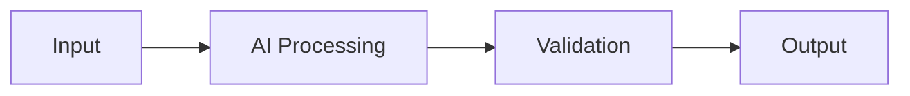

# AI Radar — YYYY-MM-DD

## 🔥 Executive Summary

## 🤖 AI Models & Generative AI

## 🧠 Agents & Agentic AI

## 🔍 RAG & Knowledge Systems

## 👁️ Computer Vision / OCR / Multimodal

## 💻 AI Coding & Software Engineering

## 🔌 MCP & Tool Ecosystem

## 📚 Research Papers

## 🛠️ Tools & GitHub Projects

## 🌎 Developer Community Trends

## 🔥 5 Things Worth Knowing

1.
2.
3.
4.
5.

## 🧪 Practical POC

## 💡 Trending Real-World Problem

### Problem

### Why It Is Difficult

### Proposed Solution

### Architecture



### Implementation Example

```csharp
// Add a concise .NET example when appropriate.
```

### Production Considerations

## Sources

- Source title - URL - Publication date - Source type
