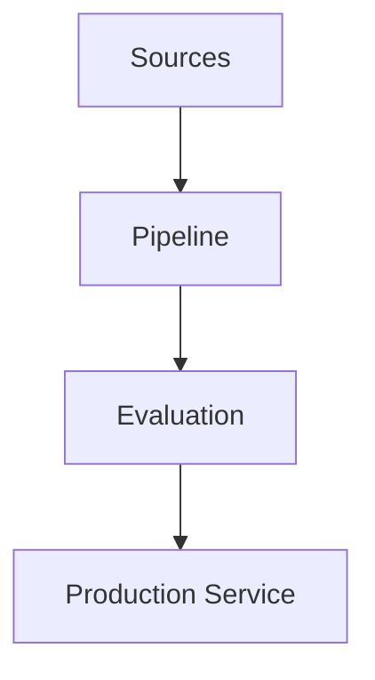

# AI Engineering Weekly — YYYY-WXX

## Executive Summary

## Biggest Developments

## Deep Technical Trends

## AI Agents

## RAG

## Computer Vision

## AI Coding

## MCP

## Research

## Tools

## Emerging Concepts

## Deep-Dive Engineering Problem

### Problem

### Architecture



### Implementation

### .NET / Python Example

```csharp
// Add a concise enterprise implementation example.
```

### Performance

### Scalability

### Security

### Cost

### Observability

### Reliability

### Evaluation

## Practical POC for This Week

## What Developers Should Learn

## Sources

- Source title - URL - Publication date - Source type
